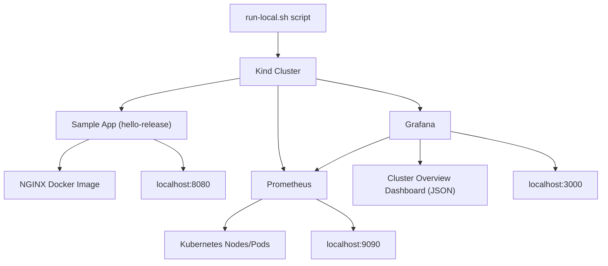
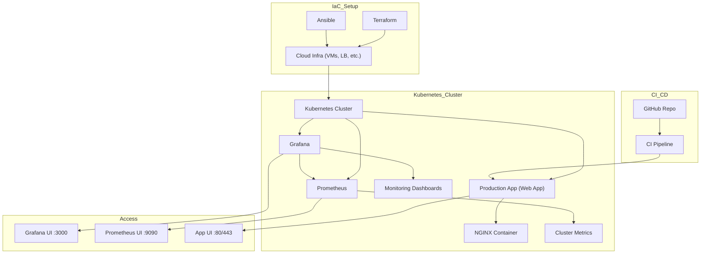
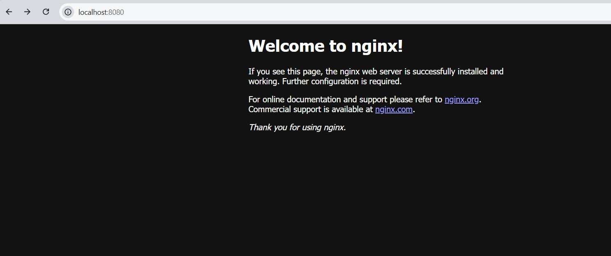
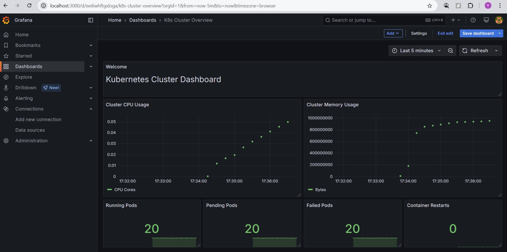

## 💼 DevOps Portfolio Project - Starter Template (Free & EKS-Focused)

This is a **hands-on DevOps portfolio project** built to demonstrate real-world tools like **Terraform**, **Helm**, **Ansible**, and **GitHub Actions** — without spending a dime on cloud. It simulates an **AWS EKS infrastructure locally** using Kind and adds full observability with Prometheus + Grafana.

---

## 🧰 Tools Used

- **Terraform** – IaC for AWS EKS (mocked)
- **Kind** – Local Kubernetes cluster (EKS simulated)
- **Helm** – App + Monitoring deployments
- **Ansible** – Lightweight local provisioning
- **GitHub Actions** – CI/CD pipeline
- **Prometheus & Grafana** – Monitoring stack

---

## 📁 Folder Structure

```
devops-portfolio/
├── terraform-eks-mock/       # Mocked Terraform code
├── kind-k8s-cluster/         # Kind config + Helm charts
├── ansible/                  # Basic Ansible playbook + inventory
├── scripts/                  # Local setup + cleanup
├── diagrams/                 # Architecture diagrams (EKS + local)
├── .github/workflows/        # GitHub Actions pipeline
├── .gitignore
└── README.md
```

---

## 🚀 Local Setup (EKS Simulated)

### ✅ 1. Create Kind Cluster & Deploy

```bash
bash scripts/run-local.sh
```

- App deployed via Helm  
- Monitoring stack installed (Prometheus & Grafana)

### 📊 Grafana Access

- URL: [http://localhost:3000](http://localhost:3000)  
- Username: `admin`  
- Password: `admin`  
- Preconfigured dashboard: ✅ `K8s Cluster Overview`

### 🧹 Tear Down

```bash
bash scripts/cleanup.sh
```

---

## 🔁 CI/CD Pipeline (GitHub Actions)

On every push to `main`:

1. Terraform: Init → Validate → Plan
2. Provision Kind cluster
3. Deploy app & monitoring stack using Helm

Pipeline: [.github/workflows/ci.yml](.github/workflows/ci.yml)

---

## 📐 Architecture Diagrams

### 🟢 Local Kubernetes Monitoring Workflow (Kind + Helm + Prometheus + Grafana)




### 🟡 Production Monitoring Architecture with Terraform, Ansible, and Kubernetes


---

## 📸 Screenshots

| App UI (localhost:8080) | Grafana Dashboard (localhost:3000) |
|-------------------------|-------------------------------------|
|  |  |


---

## 📂 Key Files

- `terraform-eks-mock/`: Defines EKS cluster (mocked, no real AWS costs)
- `kind-k8s-cluster/helm-chart/`: Sample microservice Helm chart
- `monitoring/`: Prometheus + Grafana config
- `ansible/playbook.yaml`: Basic local provisioner
- `scripts/run-local.sh`: Full environment bootstrap

---

## ⚠️ Disclaimer
Note: This project is designed for local use only.
While it simulates AWS EKS using Kind and includes Terraform/Ansible mock configurations, it has not been fully developed or tested for production use on AWS.
The Terraform code is mocked and does not provision real AWS infrastructure
Ansible is used for lightweight local provisioning, not full cloud automation
The GitHub Actions pipeline runs locally with mocked steps — not intended for cloud deployments
🛠️ This project is meant as a learning/demo environment, ideal for showcasing your DevOps skills without incurring cloud costs.

---

### ✅ Notes

- **Terraform** provisions the infrastructure (e.g., EC2, VPC, EKS, etc.).
- **Ansible** configures the provisioned resources (e.g., installs packages, sets up kubelet, joins the cluster).
- **Kubernetes** hosts the actual workloads and observability stack.
- **Prometheus** scrapes metrics from the cluster.
- **Grafana** visualizes those metrics.
- **NGINX** serves as the web server/proxy for the app.

---

## 🎯 What This Project Demonstrates

- Infrastructure-as-Code (IaC) practices
- Kubernetes deployment workflows
- CI/CD automation pipelines
- Monitoring and dashboard setup
- Cost-effective local simulation of cloud-native setups

---

## 📌 Future Ideas

- Add real EKS provisioning (paid)
- Push Docker image to ECR
- Add Alertmanager + Slack/Email alerts
- Use ArgoCD or Flux for GitOps

---

## 📄 License

MIT
